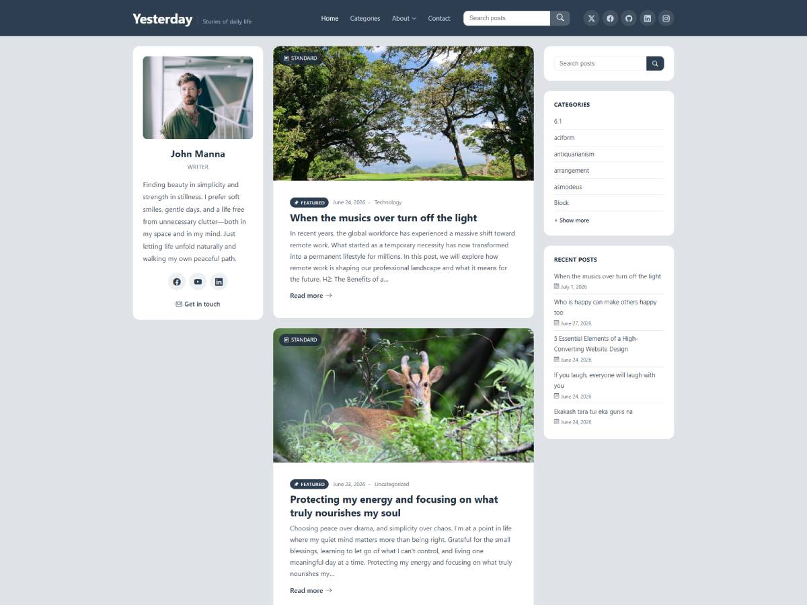

# Yesterday

A calm, content-first classic blog theme for writers and personal bloggers, built for WordPress.

**[Get it on WordPress.org →](https://wordpress.org/themes/yesterday/)** &nbsp;|&nbsp; **[Documentation](https://ethemestudio.com/)** &nbsp;|&nbsp; **[Theme page](https://ethemestudio.com/products/yesterday/)**



## Features

- Three-column desktop layout (author rail, content, widget sidebar) with clean mobile stacking
- Automatic table of contents with scroll-spy on any post or page with three or more headings
- Full support for all nine WordPress post formats, each with dedicated card styling
- A custom Author Card widget — photo, bio, auto-detected social icons, contact link
- Deep, multi-level dropdown navigation with edge-aware flyout flipping
- Fully keyboard-accessible: predictable Tab/Shift+Tab order, Escape-to-close, and a properly focus-trapped mobile menu
- A full Customizer: color palettes + accent picker, five typography presets on self-hosted webfonts, and layout toggles
- A dedicated About / Author page template with a portrait hero
- Zero external HTTP requests — every icon and font ships with the theme

## Installation

**From WordPress:** Appearance → Themes → Add New → search "Yesterday" → Install → Activate.

**Manual:** download this repository as a zip, then Appearance → Themes → Add New → Upload Theme.

Requires WordPress 6.0+ and PHP 7.4+. No plugins required.

## Development

The compiled stylesheet (`assets/css/style.css`) is built from the SCSS partials in `assets/scss/` using [Dart Sass](https://sass-lang.com/dart-sass/):

```bash
sass --style=expanded --no-source-map assets/scss/style.scss assets/css/style.css
```

## Documentation

Full setup and usage documentation is available at [ethemestudio.com](https://ethemestudio.com/).

## Support

- [WordPress.org support forum](https://wordpress.org/support/theme/yesterday/)
- [Open an issue](../../issues) on this repository

## License

Yesterday is licensed under the [GPLv2 (or later)](LICENSE).

Bundled third-party resources:
- [Bootstrap Icons](https://icons.getbootstrap.com/) — MIT License
- [Inter](https://github.com/rsms/inter), [Lora](https://github.com/cyrealtype/Lora-Cyrillic), and [Playfair Display](https://github.com/clauseggers/Playfair-Display) — SIL Open Font License 1.1

See `readme.txt` for the complete credits list.

---

Built by [Jewel Khan](https://procodr.com) for [eThemeStudio](https://ethemestudio.com).
